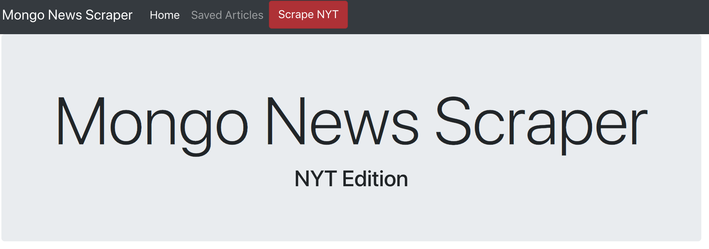

# Mongo News Scraper
## Full Stack Web Application



## Link to Heroku: 

## Overview
This is a full stack web application designed to scrape news articles from nytimes.com. Browse through the articles and save the ones you'd like by clicking 'save article'. Check out the articles used saved by navigating to the saved articles page (located in the nav), from there you can write notes relating to article. 

## Technologies Used:
* HTML5, CSS3, Twitter Bootstrap, Javascript ES6
* Cheerio
* NodeJS
* Express
* MongoDB & Mongoose
* Express Handlebars
* Axios

## To Run Application Locally
Clone this respository to your local machine and then open and run the following command in your bash terminal:
```
npm i
```
You should now have all dependencies downloaded and the app should be ready to go! Now run the following command in your bash terminal:
```
node server.js
```
Open up http://localhost:3000/ in your browser and you should see the app running. Enjoy!